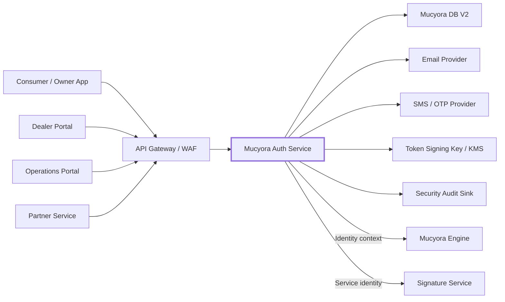
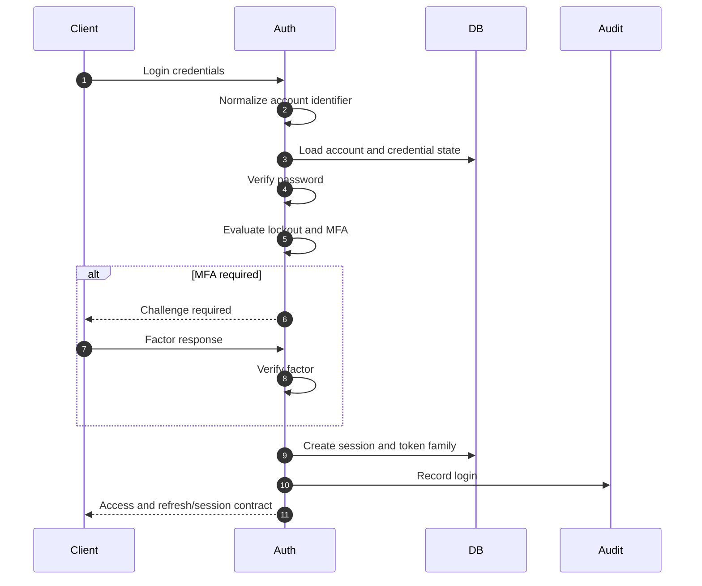
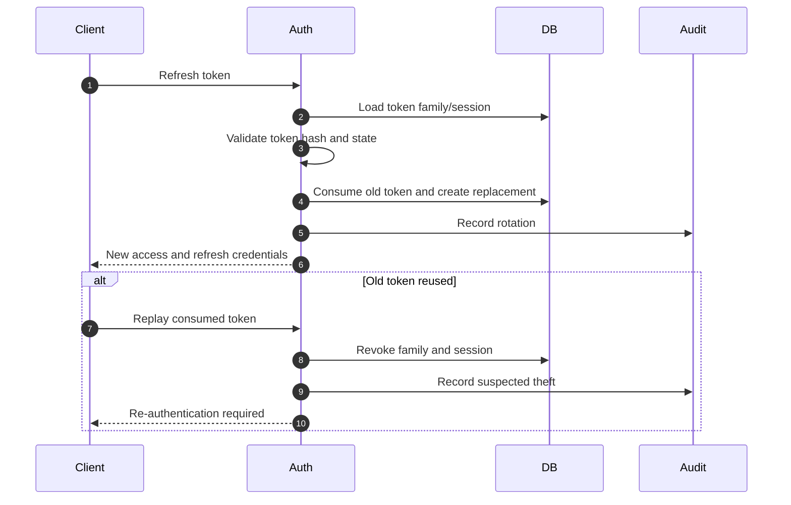
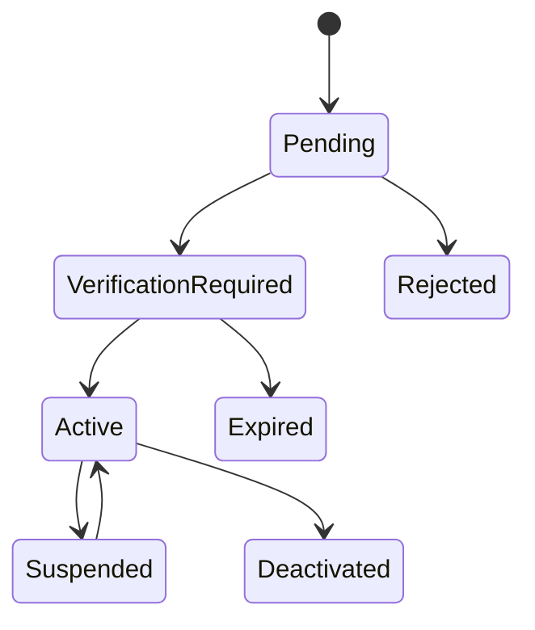
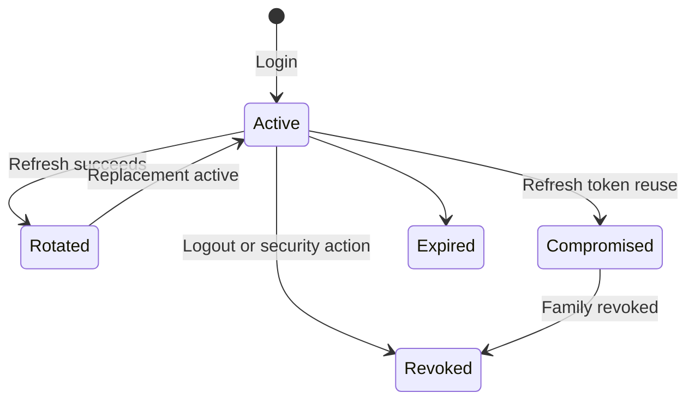
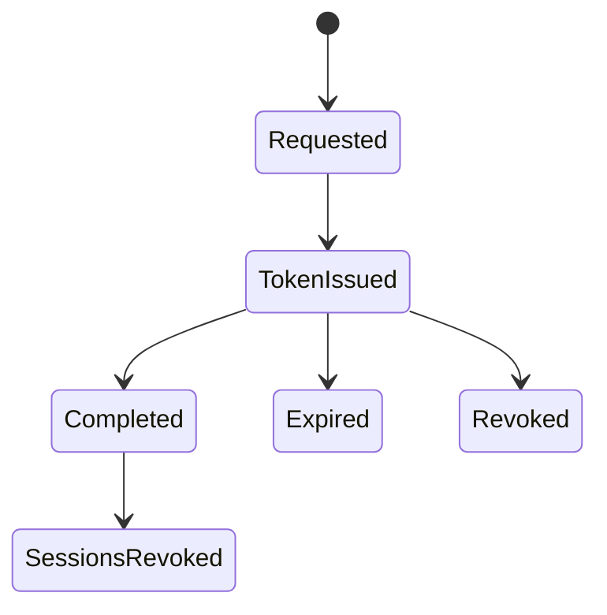
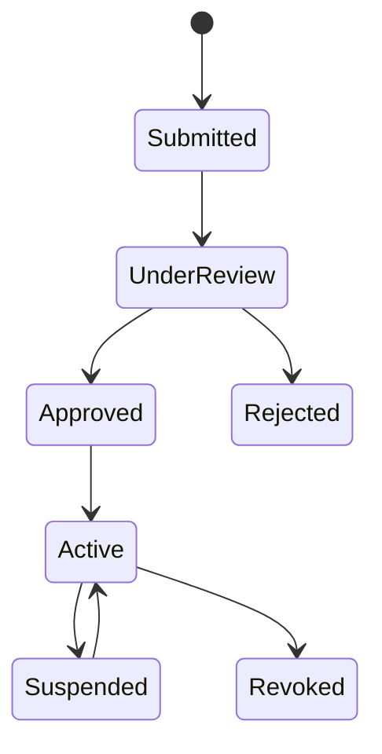
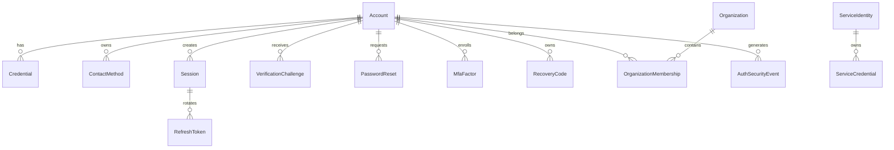
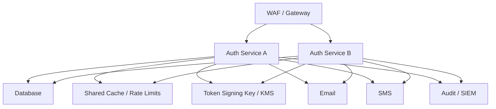

<div align="center">

# Mucyora Auth Service

### Identity, verified accounts, secure sessions, role context, and service authentication for the Mucyora platform

[](#overview)
[](#service-responsibilities)
[](#security-model)
[](#repository-access-note)

**Mucyora Auth Service** is the proposed identity and access boundary for the Mucyora platform. It should manage human and machine identities, registration, account verification, login, secure sessions, refresh-token rotation, logout, password recovery, multi-factor authentication, role context, organization memberships, and authentication security events.

[Overview](#overview) ·
[Architecture](#architecture) ·
[Identity](#identity-model) ·
[Sessions](#session-and-token-lifecycle) ·
[API](#api-contract) ·
[Setup](#local-development) ·
[Security](#security-model)

</div>

---

> [!WARNING]
> **Source reconciliation required:** the repository could not be retrieved through public GitHub or raw-file access during this documentation pass. The exact runtime, framework, routes, token format, password hashing, database models, OTP provider, configuration, tests, CI, and license must be reconciled against the source before this file is committed as implementation documentation.

> [!IMPORTANT]
> Authentication proves control of an approved account or service identity. It does not prove lawful device ownership, dealer licensing, authority to alter an incident, or permission to access a specific Mucyora record. Consuming services must still enforce role, organization, ownership, record-state, and operation-level authorization.

> [!CAUTION]
> Passwords, refresh tokens, verification tokens, reset tokens, OTPs, recovery codes, contact details, session metadata, and service credentials are sensitive. Store only what is necessary, protect token material at rest, and never expose secrets through logs or user-facing errors.

---

## Table of contents

- [Repository access note](#repository-access-note)
- [Overview](#overview)
- [Current documentation status](#current-documentation-status)
- [Service responsibilities](#service-responsibilities)
- [What this service must not own](#what-this-service-must-not-own)
- [Architecture](#architecture)
- [Trust boundaries](#trust-boundaries)
- [Technology stack](#technology-stack)
- [Project structure](#project-structure)
- [Identity model](#identity-model)
- [Account types](#account-types)
- [Roles and claims](#roles-and-claims)
- [Registration lifecycle](#registration-lifecycle)
- [Account-verification lifecycle](#account-verification-lifecycle)
- [Login lifecycle](#login-lifecycle)
- [Session and token lifecycle](#session-and-token-lifecycle)
- [Refresh-token rotation](#refresh-token-rotation)
- [Logout and session revocation](#logout-and-session-revocation)
- [Password policy](#password-policy)
- [Password-reset lifecycle](#password-reset-lifecycle)
- [Email verification](#email-verification)
- [Phone and OTP verification](#phone-and-otp-verification)
- [Multi-factor authentication](#multi-factor-authentication)
- [Recovery codes and account recovery](#recovery-codes-and-account-recovery)
- [Privileged access](#privileged-access)
- [Dealer and partner onboarding](#dealer-and-partner-onboarding)
- [Service-to-service authentication](#service-to-service-authentication)
- [JWT and claim contract](#jwt-and-claim-contract)
- [Data model](#data-model)
- [API contract](#api-contract)
- [Request examples](#request-examples)
- [Configuration](#configuration)
- [Database ownership](#database-ownership)
- [Email and SMS integrations](#email-and-sms-integrations)
- [Local development](#local-development)
- [Testing and quality](#testing-and-quality)
- [Deployment](#deployment)
- [Operations and observability](#operations-and-observability)
- [Security model](#security-model)
- [Privacy and retention](#privacy-and-retention)
- [Known design risks](#known-design-risks)
- [Implementation reconciliation checklist](#implementation-reconciliation-checklist)
- [Production-hardening roadmap](#production-hardening-roadmap)
- [Troubleshooting](#troubleshooting)
- [Contributing](#contributing)
- [License](#license)

---

## Repository access note

The supplied repository URL was not publicly retrievable during this documentation pass.

This README therefore avoids asserting unverified implementation details such as:

- the programming language and framework;
- exact routes and DTOs;
- whether access tokens are JWTs or opaque;
- refresh-token storage and rotation behavior;
- password hashing algorithm;
- OTP generation and delivery;
- whether MFA or passkeys are implemented;
- exact database tables;
- environment-variable names;
- CI/CD behavior;
- license status.

Before committing:

1. inspect the repository root and dependency manifest;
2. enumerate routes, DTOs, guards, and public endpoints;
3. inspect password hashing and credential verification;
4. inspect access and refresh token code;
5. inspect verification, reset, OTP, and MFA flows;
6. inspect database models and migrations ownership;
7. inspect configuration and secret validation;
8. inspect tests, CI, and deployment files;
9. replace proposed contracts with actual behavior;
10. remove this note after reconciliation.

---

## Overview

Mucyora connects consumers, device owners, used-device dealers, reviewers, platform administrators, and trusted partners around device provenance and ownership assurance.

The Auth Service should provide one identity boundary for those actors while leaving business authorization to the services that own each domain.

The service should answer:

1. Who is making the request?
2. Is the account active?
3. Has the required contact method been verified?
4. Has identity verification been completed when required?
5. Which roles and organization memberships are current?
6. Is the session still valid?
7. Was the refresh token rotated or reused?
8. Does the operation require recent authentication or MFA?
9. Is a machine caller trusted and properly scoped?
10. Which authentication security event should be recorded?

---

## Current documentation status

| Area | Status |
|---|---|
| Repository availability | Not publicly retrievable during this pass |
| Runtime/framework | `TBD_FROM_SOURCE` |
| Access-token model | `TBD_FROM_SOURCE` |
| Refresh-token model | `TBD_FROM_SOURCE` |
| Password hashing | `TBD_FROM_SOURCE` |
| OTP/MFA | `TBD_FROM_SOURCE` |
| Database integration | `TBD_FROM_SOURCE` |
| Email/SMS providers | `TBD_FROM_SOURCE` |
| Routes and DTOs | `TBD_FROM_SOURCE` |
| Tests and CI | `TBD_FROM_SOURCE` |
| License | `TBD_FROM_SOURCE` |
| Proposed identity architecture | Documented below |

---

## Service responsibilities

The service should own or coordinate:

- account creation and lifecycle;
- human and machine identity records;
- email and phone normalization;
- password hashing and verification;
- account activation and suspension;
- email and phone verification;
- login;
- access-token issuance;
- refresh-token issuance and rotation;
- logout and session revocation;
- password reset and password change;
- MFA enrollment and challenge;
- recovery codes;
- role and organization membership claims;
- service identities and scopes;
- token-signing key rotation;
- authentication security events;
- abuse controls;
- delivery of verification and recovery messages.

Depending on the source, it may also own passkeys, social login, government identity verification, organization invitations, or API keys.

---

## What this service must not own

The Auth Service should not:

- decide whether a device is stolen;
- determine lawful ownership;
- manage ownership transfers;
- sign provenance attestations;
- expose unrestricted user records;
- accept frontend-only authorization;
- grant organization access without current membership;
- store plaintext passwords or long-lived tokens;
- treat token claims as permanent business truth;
- allow consumers to create independent account schemas.

| Concern | Recommended owner |
|---|---|
| Account/session identity | Auth Service |
| Device and ownership state | Mucyora Engine / DB V2 |
| Signature proofs | Mucyora Signature Service |
| Domain authorization | Owning backend service |
| Evidence objects | Private object storage |
| Dealer approval | Governance/review workflow |

---

## Architecture



### Login sequence



### Refresh sequence



---

## Trust boundaries

| Boundary | Required enforcement |
|---|---|
| Anonymous caller vs. account | Rate limit and generic errors |
| Password vs. session | Strong password hashing |
| Session vs. protected API | Token validation and current account state |
| Role claim vs. business permission | Domain-service authorization |
| User vs. organization | Current membership |
| Browser vs. refresh token | Secure storage and CSRF design |
| Human vs. service identity | Separate credentials and claims |
| Auth Service vs. DB | Least-privilege runtime role |
| Auth Service vs. providers | Scoped credentials |
| Auth Service vs. signing key | KMS/HSM or protected key material |
| Reset request vs. account existence | Non-enumerating response |
| Consumed refresh token vs. active session | Rotation and reuse detection |

---

## Technology stack

Replace after source inspection.

| Layer | Actual value |
|---|---|
| Runtime | `TBD_FROM_SOURCE` |
| Framework | `TBD_FROM_SOURCE` |
| Language | `TBD_FROM_SOURCE` |
| Database client | `TBD_FROM_SOURCE` |
| Password hashing | `TBD_FROM_SOURCE` |
| Token library | `TBD_FROM_SOURCE` |
| Email provider | `TBD_FROM_SOURCE` |
| SMS provider | `TBD_FROM_SOURCE` |
| API documentation | `TBD_FROM_SOURCE` |
| Testing/CI | `TBD_FROM_SOURCE` |

---

## Project structure

Replace with the actual tree.

```text
mucyora-auth-service/
├── src/
│   ├── accounts/
│   ├── registration/
│   ├── authentication/
│   ├── sessions/
│   ├── tokens/
│   ├── verification/
│   ├── password-reset/
│   ├── mfa/
│   ├── organizations/
│   ├── service-identities/
│   ├── mail/
│   ├── sms/
│   ├── audit/
│   ├── config/
│   └── common/
├── tests/
├── docs/
├── .env.example
├── Dockerfile
├── dependency manifest
├── README.md
└── SECURITY.md
```

---

## Identity model

Separate:

- account;
- credentials;
- verified contact methods;
- organization memberships;
- sessions;
- refresh tokens;
- verification challenges;
- MFA factors;
- recovery codes;
- service identities;
- security events.

Do not overload one user table with every security state.

---

## Account types

Recommended account types:

```text
CONSUMER
DEVICE_OWNER
DEALER_USER
DEALER_ADMIN
REVIEWER
PLATFORM_ADMIN
PARTNER_USER
SERVICE_IDENTITY
```

A person may hold multiple domain roles. Roles and organization memberships should be explicit, current, and auditable.

---

## Roles and claims

Access-token claims should be minimal.

```json
{
  "iss": "https://auth.mucyora.example",
  "aud": "mucyora-platform",
  "sub": "user_example",
  "sid": "session_example",
  "type": "access",
  "roles": ["DEVICE_OWNER"],
  "organizations": [
    {
      "id": "dealer_example",
      "roles": ["DEALER_USER"]
    }
  ],
  "amr": ["pwd", "otp"],
  "auth_time": 1785420000,
  "iat": 1785420000,
  "exp": 1785420900,
  "jti": "token_example"
}
```

Do not include national IDs, device identifiers, ownership records, or sensitive contact data.

---

## Registration lifecycle



Controls:

- normalize contact details;
- prevent duplicates;
- rate limit;
- require consent;
- issue a single-use expiring verification token;
- hash tokens at rest;
- prevent public assignment of privileged roles;
- apply review to dealers, partners, and administrators;
- audit state transitions.

---

## Account-verification lifecycle

Recommended states:

```text
UNVERIFIED
PENDING
VERIFIED
EXPIRED
REVOKED
```

Verification tokens should be random, single-use, expiring, hashed, purpose-bound, and invalidated after use.

---

## Login lifecycle

Login should:

1. normalize the identifier;
2. load account and credential state;
3. verify password using a modern password hash;
4. evaluate active or suspended state;
5. apply throttling and risk controls;
6. require MFA when applicable;
7. create a session;
8. issue access and refresh credentials;
9. record a security event.

Use generic failure messages.

---

## Session and token lifecycle



### Access token

Recommended:

- short lifetime;
- signed;
- issuer and audience;
- token type;
- session ID;
- unique token ID;
- minimal claims.

### Refresh token

Recommended:

- high entropy;
- stored only as a hash;
- rotated on every use;
- bound to session and token family;
- revocable;
- reuse detection.

---

## Refresh-token rotation

Persist:

- session ID;
- token family ID;
- token hash;
- issued time;
- expiration;
- consumed time;
- revocation time;
- constrained device/session metadata.

On reuse, revoke the token family and session, write an audit event, and require login.

---

## Logout and session revocation

Support:

- logout current session;
- logout all sessions;
- revoke one selected session;
- revoke after password reset/change;
- revoke after account suspension;
- revoke after credential compromise;
- list active sessions.

---

## Password policy

Recommended baseline:

- prioritize long passphrases;
- reject known compromised passwords;
- allow password managers and paste;
- support long passwords;
- do not silently truncate;
- use a modern password hash;
- upgrade hash parameters after successful login.

Never store reversible passwords.

---

## Password-reset lifecycle



Reset requests should return the same response whether the account exists or not.

On completion:

- validate token hash, purpose, and expiry;
- hash the new password;
- consume token atomically;
- revoke sessions;
- audit;
- notify the account.

---

## Email verification

Controls:

- normalized email;
- single-use token;
- short TTL;
- resend cooldown;
- request cap;
- previous-token invalidation;
- no token logging;
- approved HTTPS frontend URL.

---

## Phone and OTP verification

Controls:

- cryptographically random code;
- short TTL;
- attempt cap;
- resend cooldown;
- request cap;
- one active challenge per purpose;
- account and phone binding;
- atomic consumption;
- awareness of SIM-swap risk.

---

## Multi-factor authentication

Preferred factors:

1. passkey or hardware security key;
2. TOTP;
3. SMS fallback under reviewed policy.

Enrollment and removal should require recent authentication. Privileged roles should require MFA.

---

## Recovery codes and account recovery

Recovery codes should be random, one-time, hashed, shown once, and invalidated when regenerated.

Account recovery should use verified channels, delay or review for high-risk accounts, user notification, session revocation, and audit.

---

## Privileged access

Privileged accounts require:

- MFA;
- shorter sessions;
- recent authentication;
- no shared accounts;
- restricted network/device policy where appropriate;
- role approval;
- durable audit;
- break-glass controls.

---

## Dealer and partner onboarding



Public registration must not automatically grant trusted dealer or partner access.

---

## Service-to-service authentication

Prefer:

- workload identity;
- mTLS;
- short-lived service JWTs;
- narrow scopes;
- private networking.

Avoid one permanent shared credential across Engine, Signature Service, and operational tools.

```json
{
  "sub": "service:mucyora-engine",
  "type": "service",
  "scope": ["device-checks:write", "attestations:request"],
  "aud": "mucyora-signature-service"
}
```

---

## JWT and claim contract

If JWTs are used, enforce:

- approved algorithms;
- issuer;
- audience;
- expiration;
- not-before;
- token type;
- subject;
- session ID where applicable;
- key ID;
- maximum lifetime.

Reject algorithm confusion and `none`.

---

## Data model



Conceptual only. Replace with actual models and enums.

---

## API contract

The following routes are proposed.

Base:

```text
/api/v1
```

### Registration and verification

| Method | Path | Access | Purpose |
|---|---|---|---|
| `POST` | `/auth/register` | Public | Register a standard account |
| `POST` | `/auth/register/dealer` | Public/reviewed | Submit dealer onboarding |
| `POST` | `/auth/verification/email/request` | Public constrained | Request or resend verification |
| `POST` | `/auth/verification/email/confirm` | Public token | Confirm email |
| `POST` | `/auth/verification/phone/request` | Constrained | Request OTP |
| `POST` | `/auth/verification/phone/confirm` | Constrained | Confirm OTP |

### Sessions

| Method | Path | Access | Purpose |
|---|---|---|---|
| `POST` | `/auth/login` | Public | Login |
| `POST` | `/auth/mfa/verify` | Challenge | Complete MFA |
| `POST` | `/auth/refresh` | Refresh credential | Rotate session |
| `POST` | `/auth/logout` | Authenticated | Revoke current session |
| `POST` | `/auth/logout-all` | Authenticated | Revoke all sessions |
| `GET` | `/auth/sessions` | Authenticated | List active sessions |
| `DELETE` | `/auth/sessions/:id` | Owner/admin | Revoke one session |

### Password recovery

| Method | Path | Access | Purpose |
|---|---|---|---|
| `POST` | `/auth/password/reset/request` | Public constrained | Request reset |
| `POST` | `/auth/password/reset/confirm` | Public token | Set new password |
| `POST` | `/auth/password/change` | Authenticated/recent auth | Change password |

### Service identities

| Method | Path | Access | Purpose |
|---|---|---|---|
| `POST` | `/internal/service-tokens` | Internal/admin | Issue service token |
| `POST` | `/internal/service-credentials/:id/revoke` | Internal/admin | Revoke credential |
| `GET` | `/jwks` | Public/internal as designed | Verification keys |

---

## Request examples

### Register

```bash
curl --request POST   --url "http://localhost:3001/api/v1/auth/register"   --header "Content-Type: application/json"   --data '{
    "email": "person@example.com",
    "phone": "+250700000000",
    "password": "a-long-unique-passphrase",
    "accountType": "DEVICE_OWNER"
  }'
```

### Login

```bash
curl --request POST   --url "http://localhost:3001/api/v1/auth/login"   --header "Content-Type: application/json"   --data '{
    "email": "person@example.com",
    "password": "a-long-unique-passphrase"
  }'
```

### Refresh

```bash
curl --request POST   --url "http://localhost:3001/api/v1/auth/refresh"   --header "Content-Type: application/json"   --data '{
    "refreshToken": "<opaque-refresh-token>"
  }'
```

Replace routes, port, fields, and token transport from source.

---

## Configuration

Replace with actual `.env.example`.

```dotenv
APP_ENV=development
APP_PORT=3001

DATABASE_URL=

ACCESS_TOKEN_PRIVATE_KEY=
ACCESS_TOKEN_PUBLIC_KEY=
ACCESS_TOKEN_ISSUER=https://auth.mucyora.example
ACCESS_TOKEN_AUDIENCE=mucyora-platform
ACCESS_TOKEN_TTL_SECONDS=900
REFRESH_TOKEN_TTL_SECONDS=2592000

PASSWORD_PEPPER=
PASSWORD_RESET_TTL_SECONDS=1800
EMAIL_VERIFICATION_TTL_SECONDS=1800
OTP_TTL_SECONDS=300
OTP_MAX_ATTEMPTS=5
OTP_RESEND_COOLDOWN_SECONDS=60

SMTP_HOST=
SMTP_PORT=
SMTP_USER=
SMTP_PASSWORD=
SMTP_FROM=

SMS_PROVIDER=
SMS_API_KEY=

FRONTEND_ALLOWED_ORIGINS=
PUBLIC_AUTH_URL=
AUDIT_SINK_URL=
```

Never commit real secrets.

---

## Database ownership

Mucyora DB V2 should own the canonical schema and migrations.

Recommended data domains:

- account;
- credential;
- contact method;
- session;
- refresh token;
- verification challenge;
- password reset;
- MFA factor;
- recovery code;
- organization membership;
- service identity;
- security event.

Auth Service should use a least-privilege runtime role and must not alter schema.

---

## Email and SMS integrations

### Email

Use for verification, password reset, security notification, and onboarding status.

Controls:

- scoped provider credential;
- approved sender domain;
- no token logging;
- bounce and abuse monitoring;
- safe frontend links.

### SMS

Use for phone verification and reviewed challenge flows.

Controls:

- E.164 normalization;
- rate limits and spending caps;
- provider callback verification;
- no sensitive message content;
- no SMS-only recovery for privileged users.

---

## Local development

Replace with the actual runtime.

```bash
git clone https://github.com/kajugadaniels/mucyora-auth-service.git
cd mucyora-auth-service
cp .env.example .env
```

Node example:

```bash
npm install
npm run start:dev
```

Python example:

```bash
python -m venv .venv
source .venv/bin/activate
pip install -r requirements.txt
```

Delete non-applicable examples. Use development-only signing keys and provider sandboxes.

---

## Testing and quality

Test:

### Passwords

- correct and incorrect credentials;
- compromised-password rejection;
- long passwords and no truncation;
- hash upgrade.

### Tokens and sessions

- issuer/audience;
- expiration and token type;
- refresh rotation;
- reuse detection;
- revoked session;
- signing-key rotation;
- concurrent refresh.

### Verification and recovery

- single use;
- expiry;
- resend cooldown;
- attempt cap;
- account enumeration;
- session revocation after reset.

### MFA and service identity

- enrollment;
- replay;
- recovery code;
- step-up requirement;
- wrong service scope;
- deactivated account.

### Resilience

- mail/SMS outage;
- DB write failure;
- audit failure;
- key-provider failure.

---

## Deployment



### Deployment checklist

- [ ] Source reconciliation complete
- [ ] TLS enabled
- [ ] exact CORS allowlist
- [ ] secure refresh-token transport
- [ ] distributed throttling
- [ ] asymmetric signing or KMS
- [ ] DB least privilege
- [ ] providers separated by environment
- [ ] health and readiness
- [ ] durable audit
- [ ] key rotation tested
- [ ] recovery tested
- [ ] MFA required for staff
- [ ] incident playbooks current

---

## Operations and observability

Metrics:

- registration;
- verification request/completion;
- login success/failure;
- lockout/risk challenge;
- MFA challenge;
- refresh success/reuse;
- password reset;
- session revocation;
- provider delivery;
- token latency;
- DB latency;
- `401`, `403`, `429`, and `5xx`.

Alert on:

- credential stuffing;
- reset or OTP abuse;
- refresh reuse;
- privileged login anomaly;
- token-signing-key anomaly;
- provider outage;
- audit failure;
- sudden authorization failures.

---

## Security model

Implemented controls must be populated from source.

Required controls:

- auth endpoints rate-limited;
- modern password hashing;
- generic authentication errors;
- hashed refresh/reset/verification tokens;
- refresh rotation and reuse detection;
- short access tokens;
- session revocation;
- MFA for privileged users;
- minimized role and organization claims;
- service scopes;
- protected signing keys;
- durable security audit;
- no secrets in logs.

See `SECURITY.md` for the full policy.

---

## Privacy and retention

| Record | Consideration |
|---|---|
| Account | Account lifecycle |
| Password hash | Current credential |
| Session | Active plus investigation window |
| Refresh token hash | Session lifetime |
| Verification/reset challenge | Short TTL |
| OTP | Minutes |
| Security event | Longer investigation period |
| Device/IP metadata | Minimized and time-bounded |
| Recovery evidence | Restricted and minimum necessary |

---

## Known design risks

1. Repository implementation is unverified.
2. Long-lived refresh tokens without rotation enable persistent theft.
3. Plaintext reset or verification tokens expose accounts after DB compromise.
4. SMS-only MFA is vulnerable to SIM swap.
5. Frontend role checks can be mistaken for authorization.
6. JWT claims can become stale.
7. One shared signing secret can compromise every service.
8. Public recovery responses can enumerate accounts.
9. OTP resend without cooldown enables abuse.
10. Concurrent refresh can create multiple active tokens.
11. Password reset may fail to revoke sessions.
12. Admin role assignment can create privilege escalation.
13. Tokens can leak through logs, links, and analytics.
14. Service API keys can become permanent, unscoped credentials.
15. Account recovery may become a support bypass.

---

## Implementation reconciliation checklist

### Repository

- [ ] runtime/framework and versions
- [ ] project tree
- [ ] license

### Authentication

- [ ] registration
- [ ] password hashing
- [ ] login
- [ ] access token
- [ ] refresh token
- [ ] logout
- [ ] session storage
- [ ] account state

### Verification and recovery

- [ ] email verification
- [ ] phone OTP
- [ ] password reset
- [ ] MFA/passkeys
- [ ] recovery codes
- [ ] provider integrations

### Authorization and operations

- [ ] roles
- [ ] organization memberships
- [ ] service identities and scopes
- [ ] rate limits
- [ ] audit
- [ ] DB models
- [ ] configuration
- [ ] tests and CI
- [ ] health/readiness

---

## Production-hardening roadmap

### Priority 0

- [ ] Reconcile source
- [ ] Modern password hashing
- [ ] Hash long-lived tokens
- [ ] Refresh rotation and reuse detection
- [ ] Generic public errors
- [ ] Distributed rate limits
- [ ] Session revocation
- [ ] Durable audit
- [ ] Health/readiness

### Priority 1

- [ ] MFA for privileged roles
- [ ] Passkeys/WebAuthn
- [ ] KMS/asymmetric token signing
- [ ] service JWT/mTLS
- [ ] compromised-password screening
- [ ] session-management UI
- [ ] risk-based login alerts

### Priority 2

- [ ] Automated signing-key rotation
- [ ] advanced account-takeover detection
- [ ] SIEM integration
- [ ] recovery dual control
- [ ] formal threat model
- [ ] penetration test
- [ ] privacy assessment

---

## Troubleshooting

### Repository cannot be accessed

Confirm repository visibility and GitHub permissions.

### Login always fails

Check identifier normalization, password-hash configuration, account state, environment secrets, and DB connectivity.

### Refresh token rejected

Check token family, expiration, hash, rotation state, prior reuse, and session revocation.

### Verification email not delivered

Check provider credentials, sender domain, bounce/spam status, and frontend URL.

### OTP repeatedly fails

Check TTL, attempt count, phone normalization, provider delay, and clock.

### Tokens work in one service but not another

Check issuer, audience, key set, algorithm, clock skew, and token type.

### Role is stale

High-risk services should revalidate current membership or use short token lifetimes and invalidation events.

### Reset succeeded but old session works

Revoke sessions after reset or document an intentional alternative policy.

---

## Contributing

1. Inspect repository guidance.
2. Treat authentication changes as security-sensitive.
3. Preserve generic errors.
4. Add abuse and lifecycle tests.
5. Update OpenAPI.
6. Update README and SECURITY.

### Pull-request checklist

- [ ] Passwords never logged
- [ ] Tokens hashed where appropriate
- [ ] Refresh rotation is concurrency-safe
- [ ] Account enumeration prevented
- [ ] Rate limits present
- [ ] Claims minimized
- [ ] Service scopes explicit
- [ ] MFA impact reviewed
- [ ] Sessions revoked when required
- [ ] Audit written
- [ ] Abuse tests included
- [ ] Documentation updated

---

## License

The repository license could not be confirmed.

Do not assume open-source redistribution rights until the actual license is inspected.

---

<div align="center">

Built for **Mucyora** — giving users, dealers, reviewers, and trusted services a secure identity without confusing authentication with ownership authority.

</div>
