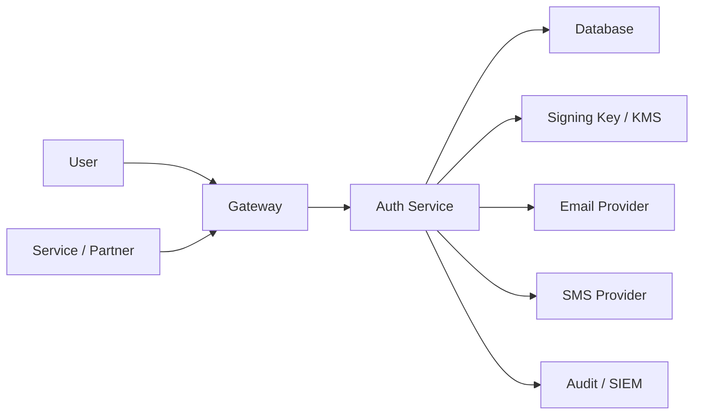

<div align="center">

# Mucyora Auth Service Security

### Authentication security policy, account-takeover threat model, token controls, privileged-access requirements, and incident response

[](#scope)
[](#session-and-refresh-token-security)
[](#password-security)
[](#source-reconciliation-status)

</div>

---

> [!WARNING]
> **Source reconciliation required:** this policy defines the expected security baseline for Mucyora Auth Service. It is not an attestation that every control is implemented. The repository was not publicly retrievable during this documentation pass. Reconcile the runtime, routes, token handling, password hashing, OTP logic, database schema, integrations, CI, and tests before production use.

> [!IMPORTANT]
> Authentication and authorization are different. This service should establish identity and trusted claims; Mucyora Engine, Signature Service, and other domain services must still enforce ownership, organization scope, signer authority, and record-state permissions.

> [!CAUTION]
> Account recovery is commonly the weakest path. Password resets, OTPs, support overrides, recovery codes, and MFA resets require the same or stronger protection than login.

---

## Table of contents

- [Scope](#scope)
- [Source reconciliation status](#source-reconciliation-status)
- [Security objectives](#security-objectives)
- [Security principles](#security-principles)
- [Protected assets](#protected-assets)
- [Data classification](#data-classification)
- [Trust boundaries](#trust-boundaries)
- [Threat actors](#threat-actors)
- [Attack surface](#attack-surface)
- [Account enumeration](#account-enumeration)
- [Registration security](#registration-security)
- [Password security](#password-security)
- [Credential stuffing and brute force](#credential-stuffing-and-brute-force)
- [Login security](#login-security)
- [Session and refresh-token security](#session-and-refresh-token-security)
- [Access-token security](#access-token-security)
- [Refresh-token rotation and reuse detection](#refresh-token-rotation-and-reuse-detection)
- [Logout and revocation](#logout-and-revocation)
- [Email-verification security](#email-verification-security)
- [Password-reset security](#password-reset-security)
- [OTP security](#otp-security)
- [MFA security](#mfa-security)
- [Passkey and WebAuthn security](#passkey-and-webauthn-security)
- [Recovery-code security](#recovery-code-security)
- [Account-recovery security](#account-recovery-security)
- [Privileged-account security](#privileged-account-security)
- [Organization-membership security](#organization-membership-security)
- [Service-identity security](#service-identity-security)
- [JWT security](#jwt-security)
- [Token-signing-key lifecycle](#token-signing-key-lifecycle)
- [API security](#api-security)
- [Rate limiting and abuse controls](#rate-limiting-and-abuse-controls)
- [CORS, cookies, and CSRF](#cors-cookies-and-csrf)
- [Input validation and normalization](#input-validation-and-normalization)
- [Error handling](#error-handling)
- [Database security](#database-security)
- [Token and challenge storage](#token-and-challenge-storage)
- [Secrets and configuration](#secrets-and-configuration)
- [Email and SMS provider security](#email-and-sms-provider-security)
- [Logging and security audit](#logging-and-security-audit)
- [Privacy and minimization](#privacy-and-minimization)
- [Retention and deletion](#retention-and-deletion)
- [Availability and resilience](#availability-and-resilience)
- [Dependency and supply-chain security](#dependency-and-supply-chain-security)
- [CI/CD security](#cicd-security)
- [Container and runtime hardening](#container-and-runtime-hardening)
- [Environment separation](#environment-separation)
- [Security testing](#security-testing)
- [Threat scenarios](#threat-scenarios)
- [Incident response](#incident-response)
- [Monitoring and alerting](#monitoring-and-alerting)
- [Vulnerability reporting](#vulnerability-reporting)
- [Security review checklist](#security-review-checklist)
- [Source reconciliation checklist](#source-reconciliation-checklist)
- [Production-hardening roadmap](#production-hardening-roadmap)
- [Document maintenance](#document-maintenance)

---

## Scope

This policy applies to:

- account registration;
- email and phone verification;
- password credentials;
- login;
- access and refresh tokens;
- logout and session management;
- password reset;
- OTP and MFA;
- passkeys and recovery codes;
- organization membership claims;
- service identities;
- token-signing keys;
- authentication security audit;
- email and SMS integrations;
- production deployment.

It also defines security expectations for services that validate Mucyora-issued tokens.

---

## Source reconciliation status

| Area | Status |
|---|---|
| Runtime/framework | `TBD_FROM_SOURCE` |
| Password hashing | `TBD_FROM_SOURCE` |
| Access-token type | `TBD_FROM_SOURCE` |
| Refresh-token storage | `TBD_FROM_SOURCE` |
| Rotation/reuse detection | `TBD_FROM_SOURCE` |
| Email verification | `TBD_FROM_SOURCE` |
| Password reset | `TBD_FROM_SOURCE` |
| OTP/MFA | `TBD_FROM_SOURCE` |
| Database | `TBD_FROM_SOURCE` |
| Rate limiting | `TBD_FROM_SOURCE` |
| Audit | `TBD_FROM_SOURCE` |
| CI/tests | `TBD_FROM_SOURCE` |
| Security contact | `TBD_FROM_SOURCE` |

Use these labels during reconciliation:

- **Implemented**
- **Partially implemented**
- **Planned**
- **Not applicable**
- **Unknown**

---

## Security objectives

### Confidentiality

Protect:

- passwords and password hashes;
- refresh tokens;
- reset and verification tokens;
- OTPs;
- MFA secrets;
- recovery codes;
- service credentials;
- token-signing keys;
- contact details;
- session metadata.

### Integrity

Protect:

- account state;
- verified contacts;
- roles;
- organization memberships;
- session and token-family state;
- MFA enrollment;
- service scopes;
- security audit.

### Availability

Maintain safe authentication during:

- credential attacks;
- provider outages;
- database degradation;
- signing-key rotation;
- traffic spikes.

### Accountability

Record:

- registration;
- verification;
- login and failure;
- refresh and reuse;
- password reset;
- MFA changes;
- role and membership changes;
- session revocation;
- service credential changes.

---

## Security principles

- deny by default;
- generic public errors;
- modern password hashing;
- short access-token lifetime;
- rotating refresh tokens;
- single-use recovery tokens;
- MFA for privileged roles;
- separate service identities;
- minimized signed claims;
- protected secrets;
- hardened account recovery;
- durable security audit.

---

## Protected assets

| Asset | Risk |
|---|---|
| Password hash | Offline cracking |
| Password pepper | System-wide credential risk |
| Refresh token | Persistent account takeover |
| Reset token | Password takeover |
| Verification token | Account activation abuse |
| OTP | Challenge bypass |
| MFA secret | Factor cloning |
| Recovery code | MFA bypass |
| Token-signing private key | Forged identity |
| Admin account | Platform compromise |
| Service credential | Backend impersonation |
| Role/membership state | Privilege escalation |
| Security audit | Hidden attack activity |

---

## Data classification

| Class | Examples |
|---|---|
| Public | Public token-verification key set |
| Internal | Auth metrics and non-sensitive configuration |
| Confidential | Email, phone, session history |
| Restricted | Roles, memberships, device/IP context |
| Highly restricted | Password hashes, tokens, MFA secrets, signing keys |

---

## Trust boundaries



Every boundary requires independent credentials, validation, and data minimization.

---

## Threat actors

- credential-stuffing attacker;
- password sprayer;
- SIM-swap attacker;
- malicious registrant;
- fraudulent dealer;
- compromised partner service;
- malicious support operator;
- compromised administrator;
- supply-chain attacker;
- attacker with a leaked database backup;
- attacker with a token-signing key.

---

## Attack surface

- registration;
- login;
- token refresh;
- logout;
- reset;
- email verification;
- phone OTP;
- MFA and passkeys;
- session listing and revocation;
- service-token issuance;
- JWKS;
- email links;
- SMS callbacks;
- admin support;
- database;
- CI/CD;
- logs and monitoring.

---

## Account enumeration

Public flows must not confirm account existence.

Affected endpoints include:

- login;
- registration;
- reset request;
- verification resend;
- OTP request.

Use generic responses and similar timing where practical. Internal audit may record exact outcomes.

---

## Registration security

Controls:

- per-IP and per-contact throttling;
- CAPTCHA or risk challenge when needed;
- normalized email and phone;
- duplicate controls;
- compromised-password screening;
- no privileged role from public input;
- consent capture;
- expiring verification challenge;
- reviewed dealer/partner/admin onboarding;
- security audit.

Do not trust self-declared organization membership.

---

## Password security

Use:

- Argon2id, scrypt, or reviewed bcrypt settings;
- a unique salt;
- optional protected pepper;
- hash-parameter versioning;
- transparent rehash after successful login.

Allow:

- long passphrases;
- password managers;
- paste;
- Unicode according to a documented policy.

Reject:

- known compromised passwords;
- very short passwords;
- passwords equal to email or phone.

Do not silently truncate, store password hints, email passwords, or log password values.

---

## Credential stuffing and brute force

Use layered defenses:

- gateway and application limits;
- IP and account limits;
- device and risk signals;
- progressive delays;
- breached-password screening;
- MFA;
- alerting.

Avoid a simple permanent lockout that lets an attacker deny service to another user.

---

## Login security

Login should:

1. normalize the identifier;
2. retrieve account state safely;
3. verify the password in constant-time behavior provided by the hash library;
4. enforce active/suspended state;
5. evaluate abuse or lockout risk;
6. require MFA where appropriate;
7. create a session;
8. write a security event.

Return a generic failure message.

---

## Session and refresh-token security

A session should contain:

- unique session ID;
- account ID;
- token family ID;
- created and last-used time;
- expiration;
- authentication methods;
- revocation state;
- constrained device metadata.

Refresh tokens should be high entropy and stored only as hashes.

---

## Access-token security

If JWTs are used:

- use a short TTL;
- prefer asymmetric signing;
- require issuer and audience;
- include token type, `kid`, `jti`, and session ID;
- keep claims minimal.

Do not place full contact, identity, device, or ownership information in tokens.

---

## Refresh-token rotation and reuse detection

On each refresh:

1. hash and locate the presented token;
2. confirm the token family and session are active;
3. atomically consume the token;
4. create a replacement;
5. return it once.

On reuse:

- revoke the entire token family;
- revoke the session;
- record suspected theft;
- notify the account where appropriate;
- require login.

Use a transaction and unique constraint to handle concurrent refresh requests.

---

## Logout and revocation

Support:

- current-session logout;
- all-session logout;
- selected session revocation;
- security/admin revocation;
- password-reset revocation;
- account-suspension revocation.

Short access-token lifetimes limit residual access after revocation.

---

## Email-verification security

Verification tokens must be:

- cryptographically random;
- single-use;
- hashed at rest;
- expiring;
- account- and purpose-bound.

Resend behavior requires:

- cooldown;
- hourly and daily caps;
- prior-token invalidation;
- generic response.

Links must use an approved HTTPS host and avoid third-party analytics that receive token query values.

---

## Password-reset security

Reset request:

- generic response;
- strict throttling;
- short TTL;
- hashed token;
- one active challenge or controlled token family.

Completion:

- consume atomically;
- validate the new password;
- revoke sessions;
- write audit;
- notify the user.

Support staff should not directly set a password.

---

## OTP security

- use a cryptographically secure random code;
- short TTL;
- attempt cap;
- resend cooldown;
- request cap;
- account/contact/purpose binding;
- atomic consumption;
- protected storage;
- uniform errors.

Never log OTP values.

---

## MFA security

Privileged accounts require MFA.

Preferred factors:

1. passkey or hardware security key;
2. TOTP;
3. SMS only as a reviewed fallback.

Enrollment and removal require recent authentication. MFA reset requires stronger recovery and audit.

---

## Passkey and WebAuthn security

If implemented:

- validate origin and relying-party ID;
- use a single-use challenge;
- verify signature and user-verification flags;
- bind the credential to the account;
- store credential public key and counters safely;
- review backup-eligibility policy.

---

## Recovery-code security

Recovery codes must be:

- high entropy;
- one-time;
- hashed;
- shown only once;
- limited in count;
- invalidated when regenerated.

Using a recovery code should trigger a security notification.

---

## Account-recovery security

Recovery must resist social engineering.

Use:

- verified channels;
- cooling-off period for privileged accounts;
- evidence and review;
- user notification;
- session revocation;
- durable audit;
- separation of support and approval roles.

---

## Privileged-account security

Require:

- phishing-resistant MFA where possible;
- shorter session lifetime;
- recent authentication for sensitive actions;
- no shared accounts;
- role approval;
- session review;
- network/device restrictions where suitable;
- break-glass controls.

---

## Organization-membership security

Role claims must derive from current trusted membership.

Controls:

- organization scope;
- approved inviter/creator;
- active status;
- validity period;
- no self-grant;
- final-admin protection;
- propagation of membership revocation.

High-risk services should recheck current membership rather than relying only on an old token.

---

## Service-identity security

Service identities require:

- unique subject;
- narrow scopes;
- explicit audience;
- short token lifetime;
- workload identity, mTLS, or protected service credentials;
- revocation;
- audit.

Do not reuse human refresh-token flows for machine callers.

---

## JWT security

Validate:

- `alg`;
- signature;
- issuer;
- audience;
- expiration;
- not-before;
- issued-at;
- subject;
- token type;
- maximum lifetime.

Reject:

- `none`;
- algorithm/key confusion;
- missing audience;
- unsupported critical headers.

---

## Token-signing-key lifecycle

Keys require:

- KMS/HSM generation where possible;
- key ID;
- activation;
- overlapping verification window;
- rotation;
- retirement;
- emergency revocation;
- audit.

Retain old public verification keys until every token signed by them has expired.

---

## API security

- TLS;
- authentication by default;
- strict DTOs;
- request-body limits;
- content-type enforcement;
- secure headers;
- request IDs;
- safe errors;
- no debug mode in production.

Internal service-credential endpoints must not be publicly reachable.

---

## Rate limiting and abuse controls

Use shared, distributed limits for:

- login;
- registration;
- refresh;
- verification resend;
- reset request;
- OTP request and verify;
- MFA verify;
- service-token issuance.

Correlate by IP, account, normalized contact hash, organization, and device risk signal.

---

## CORS, cookies, and CSRF

If cookies store refresh or session credentials:

- `HttpOnly`;
- `Secure`;
- appropriate `SameSite`;
- narrow path/domain;
- CSRF token;
- origin validation.

If tokens are returned in JSON, document client storage and XSS risks.

CORS must use exact trusted origins.

---

## Input validation and normalization

- normalize email consistently;
- normalize phone to E.164;
- validate UUIDs;
- enforce length limits;
- reject control characters;
- prevent mass assignment;
- reject unknown fields on security-sensitive commands.

Do not normalize passwords in a surprising or undocumented way.

---

## Error handling

Do not reveal:

- whether an account exists;
- password-hash internals;
- token-parser details;
- database schema;
- provider internals;
- stack traces.

Return a request ID for support investigation.

---

## Database security

Use Mucyora DB V2 schema and migrations with a least-privilege runtime role.

The Auth Service should not:

- alter schema;
- manipulate migration history;
- delete immutable security events;
- access unrelated device or evidence data.

Critical token and session transitions require transactions and constraints.

---

## Token and challenge storage

Store only hashes for:

- refresh tokens;
- password-reset tokens;
- verification tokens;
- recovery codes;
- high-entropy API keys.

OTP storage should be short-lived, protected, attempt-limited, and purpose-bound.

Never store plaintext long-lived tokens for later retrieval.

---

## Secrets and configuration

Secrets include:

- token-signing private key;
- password pepper;
- database password;
- SMTP password;
- SMS credential;
- cookie encryption key;
- service-credential hashing secret.

Use a managed secret store, separate values by environment, rotate, validate at startup, and never log them.

---

## Email and SMS provider security

### Email

- scoped provider credentials;
- SPF, DKIM, and DMARC;
- safe templates;
- no token logging;
- bounce and abuse monitoring.

### SMS

- destination and region restrictions;
- spending caps;
- signed provider callbacks;
- toll-fraud monitoring;
- no sensitive message content.

---

## Logging and security audit

Audit events should include:

- registration;
- verification;
- login success/failure;
- refresh;
- reuse detection;
- logout;
- reset;
- MFA changes;
- role and membership changes;
- service credential issuance/revocation;
- administrative recovery.

Redact:

- passwords;
- tokens;
- OTPs;
- MFA secrets;
- cookies;
- full phone/email where not required.

---

## Privacy and minimization

Token claims should contain only the identity and authorization context needed by consuming services.

Do not put in tokens:

- national identifiers;
- full device identifiers;
- ownership history;
- police data;
- private contact information beyond a justified need.

Session metadata should be minimized and time-bounded.

---

## Retention and deletion

| Data | Retention consideration |
|---|---|
| Account | Account lifecycle |
| Password hash | Current credential |
| Session | Active plus investigation window |
| Refresh-token hash | Session duration |
| Reset/verification challenge | Short TTL |
| OTP | Minutes |
| Security event | Longer security/legal period |
| Device/IP metadata | Minimized and time-bounded |

Deletion must preserve required audit and legal obligations.

---

## Availability and resilience

Use:

- database pool limits;
- shared rate limits;
- provider timeouts;
- queues for email and SMS;
- health/readiness checks;
- graceful shutdown;
- token-key cache with safe rotation;
- backpressure.

Provider outage must not bypass verification or MFA.

---

## Dependency and supply-chain security

- lock dependencies;
- scan for vulnerabilities;
- minimize authentication and crypto dependencies;
- monitor advisories;
- run secret scanning;
- produce an SBOM;
- sign or verify build artifacts;
- remove unused packages.

---

## CI/CD security

- protected branches;
- required security tests;
- secret scanning;
- SAST;
- dependency and container scanning;
- environment approval;
- least-privilege CI credentials;
- no production token-signing administration in untrusted pull-request jobs.

Authentication changes require focused review.

---

## Container and runtime hardening

- non-root runtime;
- minimal base image;
- read-only filesystem where practical;
- debug disabled;
- production mode;
- restricted egress;
- resource limits;
- runtime-mounted secrets;
- TLS and time synchronization.

---

## Environment separation

Use separate:

- databases;
- token-signing keys;
- email and SMS credentials;
- cookie domains;
- frontend origins;
- service credentials;
- audit sinks.

Never use production accounts or tokens in tests.

---

## Security testing

### Account attacks

- enumeration;
- brute force;
- credential stuffing;
- registration abuse;
- reset abuse;
- OTP abuse.

### Tokens

- wrong audience;
- wrong issuer;
- expiry;
- wrong token type;
- algorithm confusion;
- refresh reuse;
- concurrent refresh;
- key rotation.

### MFA and recovery

- replayed TOTP;
- reused recovery code;
- factor removal without step-up;
- support recovery bypass;
- passkey-origin mismatch.

### Authorization

- self-grant role;
- cross-organization membership;
- service scope escalation;
- deactivated account.

### Resilience

- provider outage;
- database failure;
- audit failure;
- signing-key rotation failure.

---

## Threat scenarios

### Credential stuffing

Mitigations:

- compromised-password screening;
- throttling;
- risk signals;
- MFA;
- alerts.

### Refresh-token theft

Mitigations:

- hash storage;
- rotation;
- reuse detection;
- session revocation;
- secure cookie or client storage.

### SIM swap

Mitigations:

- do not rely solely on SMS for privileged recovery;
- require another factor or review.

### Malicious support recovery

Mitigations:

- role separation;
- evidence;
- delay;
- audit;
- user notification.

### Token-signing-key compromise

Mitigations:

- KMS/HSM;
- rotation;
- emergency revocation;
- short token TTL;
- consumer notification.

### Stale role token

Mitigations:

- short access-token TTL;
- current membership checks for sensitive operations;
- invalidation events.

---

## Incident response

### Account takeover

1. revoke active sessions;
2. freeze risky changes;
3. reset credentials;
4. inspect security events;
5. restore verified contacts;
6. notify the user;
7. investigate the source.

### Refresh-token reuse

- revoke the family;
- revoke the session;
- record and alert;
- require login;
- inspect related sessions.

### Token-signing-key compromise

- stop issuance with the compromised key;
- rotate and publish new verification keys;
- reject the compromised key ID where architecture permits;
- revoke sessions/tokens as appropriate;
- notify all consuming services;
- inspect forged-token exposure.

### Provider compromise

- revoke provider credential;
- stop affected delivery;
- assess token/message exposure;
- rotate relevant secrets;
- monitor affected accounts.

### Privileged-account compromise

- suspend account;
- revoke all sessions;
- inspect actions;
- revert unauthorized role changes;
- preserve audit;
- initiate the formal incident process.

---

## Monitoring and alerting

Alert on:

- login-failure spikes;
- password spraying;
- reset and OTP spikes;
- refresh-token reuse;
- new privileged role assignment;
- MFA removal;
- unusual administrator login;
- provider credential failure;
- token-signing-key access anomaly;
- audit-write failure;
- elevated `401`, `403`, `429`, and `5xx`.

---

## Vulnerability reporting

Replace these placeholders:

```text
SECURITY_CONTACT=TBD
IDENTITY_SECURITY_OWNER=TBD
ON_CALL=TBD
```

Do not open a public issue for a vulnerability involving credentials, sessions, or user data.

---

## Security review checklist

- [ ] Generic authentication errors
- [ ] Modern password hashing
- [ ] Compromised-password screening
- [ ] Short access-token lifetime
- [ ] Refresh tokens hashed
- [ ] Rotation and reuse detection
- [ ] Reset and verification tokens hashed
- [ ] OTP rate-limited
- [ ] MFA for privileged users
- [ ] Roles cannot be self-granted
- [ ] Service identities scoped
- [ ] Signing keys protected
- [ ] Sessions revocable
- [ ] Security audit durable
- [ ] Providers secured
- [ ] Abuse tests present
- [ ] Incident playbooks current

---

## Source reconciliation checklist

### Source

- [ ] runtime and framework
- [ ] routes and public endpoints
- [ ] password hashing
- [ ] access-token format
- [ ] refresh storage and rotation
- [ ] session model
- [ ] verification and reset
- [ ] OTP and MFA
- [ ] roles and memberships
- [ ] service identities
- [ ] database
- [ ] configuration
- [ ] providers
- [ ] audit
- [ ] CI and tests
- [ ] vulnerability contact

### Gap analysis

- [ ] label every control as implemented, partial, planned, not applicable, or unknown
- [ ] document current weaknesses
- [ ] remove non-applicable controls
- [ ] link supporting tests
- [ ] assign remediation owners and deadlines

---

## Production-hardening roadmap

### Priority 0

- [ ] Reconcile source
- [ ] Modern password hashing
- [ ] Hash all long-lived tokens
- [ ] Refresh rotation and reuse detection
- [ ] Generic public errors
- [ ] Distributed throttling
- [ ] Reset revokes sessions
- [ ] Durable security audit
- [ ] Health/readiness

### Priority 1

- [ ] MFA for privileged roles
- [ ] Passkeys/WebAuthn
- [ ] KMS/asymmetric token signing
- [ ] service JWT or mTLS
- [ ] compromised-password screening
- [ ] reviewed account recovery
- [ ] SIEM alerts

### Priority 2

- [ ] automated signing-key rotation
- [ ] advanced account-takeover detection
- [ ] formal threat model
- [ ] penetration test
- [ ] privacy assessment
- [ ] disaster-recovery exercise
- [ ] SBOM and artifact signing

---

## Document maintenance

Review at least quarterly and whenever:

- the token model changes;
- password hashing changes;
- MFA or recovery changes;
- a public authentication route is added;
- an email or SMS provider changes;
- the role model changes;
- a security incident occurs;
- a penetration test finds a material issue.

---

<div align="center">

Mucyora authentication is trustworthy only when credentials, sessions, recovery, roles, service identities, and security events are protected as one lifecycle.

</div>
